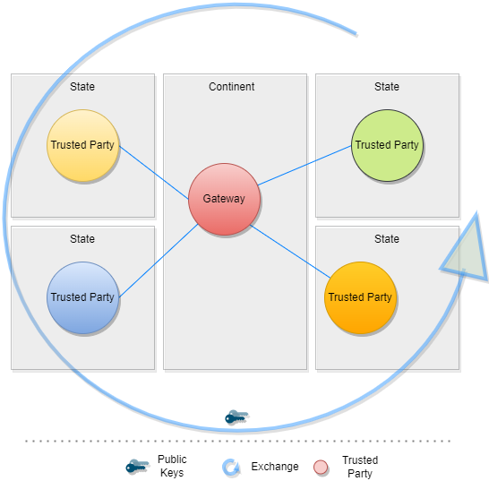
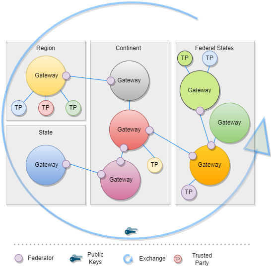
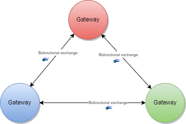
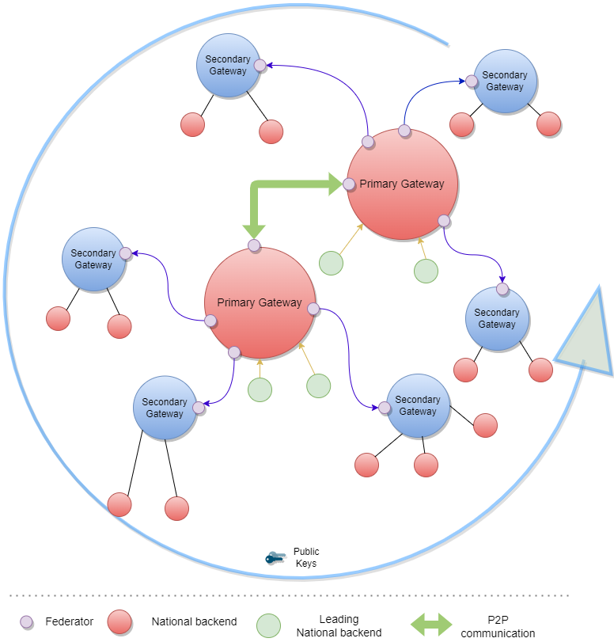
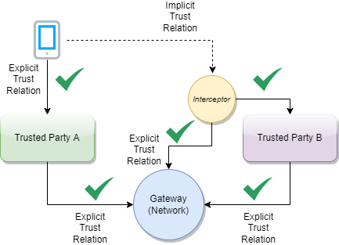

# Terminology

|Term     |       Description       | 
|---------|--------------------------|
|DCC |   Digital Covid Certificate.|
|DDCC|Digital Documentation Covid Certificate.|
|DCC Gateway (DCCG) |REST web-application for exchange of document signer certificates, dcc value sets, dcc business rules and revocation lists for dcc verification purposes between the national backends of connected states.|
|DDCC Gateway (DDCCG)|Digital Documentation Covid Certificate Gateway is an extended version of the DCCG. It is enhanced functionality allowing for interoperability between multiple gateways and in support of the DDCC specification.|
|Member State| Any country which is connected to DDCC gateway. Member States should provide at least one National Backend for connecting to DDCCG.
|CSCA |Country Signing Certificate Authority. This is a signing certificate which is used to issue DSC. This certificate is stored securely and used via an air-gap to issue DSC.|
|DSC| Document Signer Certificate.  The DSC is the certificate used to digitally sign the vaccination credential. |
|NB|National backend. The Member State national backend system for managing the local part of information. The implementation of NB is not in the scope of this document. A national backend can be also understood as a trusted party onboarded in the gateway (can be a script, a proxy or a web server as well).|
|NBTLS|The TLS client authentication certificate of a national backend, used to establish the mutual TLS connection from the NB to the DDCCG.|
|NBUP|The certificate that a national backend uses to sign data packages that are uploaded to the DDCCG.|
|DDCCGTA|The Trust Anchor certificate of the DDCCG formerly known as DCCGTA or DGCGTA. The corresponding private key is used to sign the list of all CSCA certificates offline.|
|CMS| Cryptographic Message Syntax. According [RFC5652](https://datatracker.ietf.org/doc/html/rfc5652).|
|JRC|European Joint Research Centre.|
|OG|Origin Gateway.|
|[CQL](https://cql.hl7.org/)|Clinical Query Language.|

# Introduction
This architectural specification provides the means to establish a federated trust network for use with the WHO Digital Documentation of Covid Certificates (DDCC) guidance documents and specifications.   An assumption of this document is that WHO Member States may establish their own independent national trust networks, participate in a regional trust network, or wish to participate in a global federated trust network, and that they wish for these trust networks to be interoperable for domestic and cross-jurisdictional use.   While specific governance and policy considerations needed in the establishment of such interoperable trust networks is out of scope of this document, the intent is that the technical design within this document would support multiple national and cross-jurisdictional policies.  

The DDCC Gateway (DDCCG) specifications in this document are designed to support the DDCC specification, which acts as bridging/umbrella specification for various digital covid certificates (e.g. EU’s DCC, Smart Health Cards, DIVOC, and ICAO).  This specification builds of the [EU Digital Covid Certificate Gateway](https://ec.europa.eu/health/sites/default/files/ehealth/docs/digital-green-certificates_v2_en.pdf) by extending it in several important ways:
- allowing for federation and peer exchange of information between gateways;
- supporting access to metadata content (e.g. value sets/codings, business rules) with explicit adherence to the HL7 FHIR specification;
- providing an explicit means for revocation of digital covid certificates; and
- allowing for (optional) support of online verification and validation workflows.

Within the current DCC system the centralized gateway plays the key role of establishing  trust between all of the connected Member States. The gateway operators follow a well documented process to establish the identity and onboard the trust anchor of each Member State. The DDCCG builds upon this system to enable the creation of trust gateways by other organizations which can then form a federated network of trust gateways, supporting all of the major covid credential certificates.

# Trusted Party vs. National Backend
The current DCC Gateway design is fully focused on the trust establishment between “National Backends” in terms of a system operated/owned by a national health authority. This can be a script, a fully automated solution or a manual process, which is able to connect the gateway trustfully and be able to do the up and downloads of the content. What other concrete solutions are behind is not more scope of the gateway itself. Within the DDCC scope, it’s not more precise to speak about “National Backend”, because there can be other parties which can be connected with their publishing system to a gateway in the network. Therefore the term “national backend” should be understood within this scope more as “Trusted Party” in terms of an attendee which gots access to a trusted gateway. The trusted gateway or the federator acts then as well as “Trusted Party” to other gateways.

# Gateway Design Vision
The current design of the EU DCC Gateway is a single centralized system which establishes trust between DCC participants and enables business rules,value sets and revocation lists to be shared. If another region in the world establishes such a gateway, there is currently no way in the architecture to exchange these trusted data between the two gateways. In the new architecture within the DDCC context, the architecture shall be updated such that multiple gateways can be connected to each other. This shall allow in the future the creation of groups which can be enabled step by step in a wider range to establish a federation. For instance the gateway content can be interesting to non-authority parties e.g. airlines, which wants to have a read only copy of the gateway content. This can be established by onboarding the airline in a gateway which was specially setup for this purpose and is connected to the official gateway. To achieve this goal, the architecture must support multiple operation modes e.g. Primary-Secondary. 
The current implementation of EU DCCG is, as said before, a one level system which serves as a central hub for storing and managing the information gathered from the Trusted Parties.

  

The  DDCCG should realize this enhancement of the current implementation of DCCG with the purpose to create a network between multiple  Gateways for exchanging DDCC associated public key material, value sets and business rules between different parties (authority, non-authority, commercial etc.). Every Gateway can connect to every other Gateway by manually configuring the list of connections and trust relationships. To manage the connections and their download behavior a new component federator is introduced. The Federator is a microservice acting in the role of an automated download client between two Gateways and fulfilling all responsibilities of trusted data exchange. 

  

The backbone for this data exchange is the functionality of the current connector library which connects to the gateway and provides for the consumer the most necessary functionalities. This library is enhanced by the functionality to connect multiple gateways instead of one.

# Use Cases
## Bilateral Onboarding
With the functionality of the connector library, the first use case can be to connect as a trusted party to multiple gateways for downloading/uploading content. This requires onboarding on both gateways. 

  

## Peer to Peer Exchange
In the peer to peer setup, two or more gateways are able to exchange their data bi directional. The source and the target gateway enable each other to download the data. All exchanged data will be appended to the existing data within the gateway. This can include the data of third party gateways, if permitted by the data exchange agreement between two gateways. 

  

## Primary-Secondary Exchange
The primary-secondary exchange setup declares one or several gateway as primary source, and a set of gateways as secondaries . Within this mode, the secondaries will download the data of the primary and append it to their own dataset or replace the own dataset with the downloaded data. The primary ignores the data of the secondaries, which means that the secondaries act just as read copies of the primary gateway. The leading national backends can connect to the primary gateway and upload the data to the one primary gateway. 

  

## Combined Sources Exchange
Within this mode, the gateway will download from multiple gateways the data and append it to its own data set. This results in a combined collection.  

  

## Trust Mediator
The gateway content can be used to establish trust between attendees which are just loosely coupled. E.g. Verifier Devices which are known by Trusted Party A, but not directly known by Trusted Party B.

  

To establish the trust between them, a trust mediator can be generated which relies on the trustlist of the gateway. The mediator can then use this information to decide whether the trust relationship is given or not. For instance, the interceptor can check if a signature of a JWT was created by the public key of a certificate which was signed by an onboarded CSCA. When the CSCA is onboarded and trusted, it proves that the signature was made by someone which has the trust of this CSCA. The trust for this attendee is then also given. 

  

# Architecture Overview
## Metadata Exchange
A critical role of a DDCC Gateway is to provide an interoperable means for exchanging key metadata in support of digital covid certificates using the HL7 FHIR standards. This includes, in particular:
- <b>Value Sets</b> should be shared using the transactions defined in the IHE Sharing Value Sets and Concept Maps (SVCM) profile and including the following resources:
  - HL7 FHIR ValueSet resources for the sharing of codings and terminologies referenced by the various digital covid certificate specifications (e.g. allowed vaccines or tests).   - HL7 FHIR ConceptMaps may be used to provide mappings between jurisdictionally defined coding and those within the DDCC specification. 
- <b>Business Rules</b> should follow the  and  including the following resources:
  - HL7 FHIR Library resources for sharing libraries of business rules expressed using Clinical Quality Language (CQL)
  - HL7 FHIR PlanDefinition resources for indicating which business rule should be executed based on the relevant validation or continuity of care use cases.
  
To abstract these requirements, the DDCC gateway will introduce a new functionality called “Trusted References”, which allows it to share any kind of service endpoint without sharing the content itself. For backwards compatibility, the functionality for the DCC Business Rules and Value Sets remain in the architecture, but can be configured to be disabled. The explicit endpoints for business rules and value sets will be replaced by the trusted references, because the wide variance of medical content should be left to fhir server implementations instead of implementing each service in the gateway itself.  

## Public Key Exchange
A critical role of a DDCC Gateway is to provide a way to share public keys that are used to sign digital covid certificates as well as a means to provide lists of revoked public key certificates.

## Reference Exchange
To ensure that all attendees in the system have the precise knowledge about important sources e.g. FHIR value sets or Business Rule, the gateway provides the functionality to store securely and trustfull references. These references can be stored in the format of URLs.

## Issuer Exchange
For some Credential Types  e.g. Verifiable Credentials is necessary to ensure the trust into issuers of those Credentials. The most credentials carry an issuer id like an http url or any did where the public key material is behind to verify these credentials. To provide a trusted list of these issuers, the gateway provides functionality to upload issuer IDs.  

