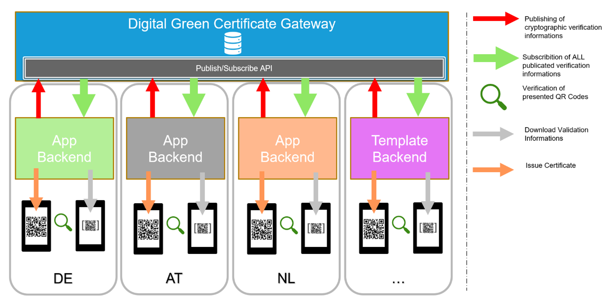
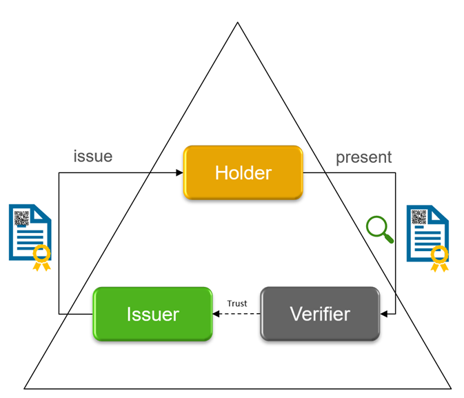
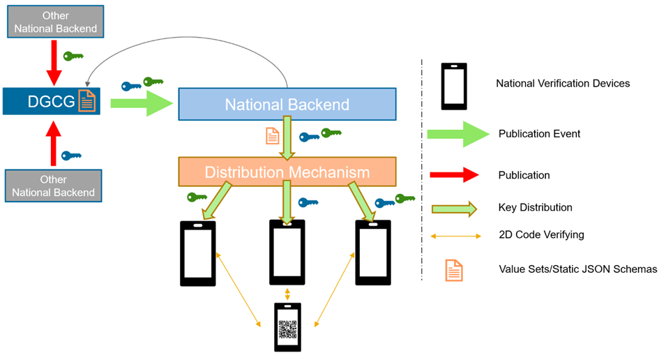
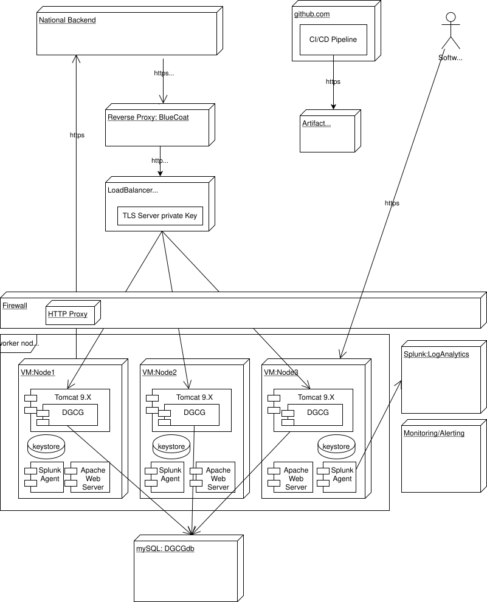

# Software Design EU Digital Green Certificates Gateway
by Michael Schulte (m.schulte@t-systems.com)

##	Introduction
This documents describes detailed aspects of the implementation of the
EU-digital-green-certificates Gateway. It is closely related to the document [trust-framework_interoperability_certificates](https://ec.europa.eu/health/sites/health/files/ehealth/docs/trust-framework_interoperability_certificates_en.pdf), 
to which describes the overarching framework and structure. The  [European Digital Green Certificate Gateway](https://ec.europa.eu/health/sites/health/files/ehealth/docs/digital-green-certificates_v2_en.pdf)  defines the  gateway structure defines the high level architecture. 

Target audience for this document are software engineers who want to get a better understanding of the insight of the implementation to be able to contribute.

This document is not finished, feedback is welcome and will change its content.


#	Overview
##	Purpose of the Software System
The Digital Green Certificate Gateway (DGCG) has the purpose to support the EU trust framework. 
It provides the operability to securely share validation and verification across the connected national backends. 
With the usage of DGCG Each national backend is free to distribute the keys via any preferred technology to support the national verification devices in the best way. 
If the Digital Green Certificate is in a correctly formatted 2D code, each verifier device can verify each code from other countries, if the verifier is connected to the backend (online verification) or if it has downloaded and stored the necessary public keys beforehand (offline verification).

##	Core Entities
|Entity|	Definition|	
| ------------- |:-------------:|
| trusted_party | stores the certificate for the trusted parties|
| signer_information | stores the certificate for the signer |
| audit_event | stores all events happening in the system |

# Context View
The diagram below shows the api endpoints from the DGC Gateway and the dataflow from and to national backends.

National Health Authorities acting the certificate management process.

# Software Design

## Communication
This is a condesed overview of the comminication of the DGCG
### Triangle of Trust
The triangle of trust is the blueprint for Green Certificate interoperability: 
-**Holder**: A Green Certificate (DGC) owner (i.e., a citizen with a vaccination, negative PCR test result, or positive anti-body test result)—note that the Green Certificate can be held digitally within a wallet app or on paper (or both)
-**Issuer**: A national authority 
-**Verifier**: An offline/online verifier (e.g., customs officers, police, or hotel staff)

How does the verifier know which issuer is trustworthy? In a personal relationship, one would decide by experience. In this architecture, the DGCG tells the verifier which issuers are trustworthy by providing cryptographically anchored information.
### Distribution of Verification Information
Exactly how each national app communicates with the corresponding national backend -whether via CDN, active push, or otherwise - is left to each country. Important here is the cryptographically secured E2E protection between the member states.

### Communication ways
- Device-to-device communication is built on a standardized 2D code and verifier format defined by the EU Trust Framework.
- A direct backend-to-backend communication is not necessary, because the main purpose of the DGCG solution is to provide verification information. 
### Trust
To ensure that just data from trusted parties are accepted. The system contains a trust list which is signed entry by entry air gapped by an official signer. This signer, signs with his private key each request of onboarding and provides this signed information to the DGCG operator which can set this entry on the trust list. This guarantees that no external attacker or another party than the trusted signer can create valid records for the trust list. The public key of the trusted signer is shared out of band to the other parties, to establish an effective trust anchoring.


## Interfaces
DGCG provides a simple REST API with common upload and download functionality for trusted information.

The are described further with a OpenAPI doc and in the document [European Digital Green Certificate Gateway](https://ec.europa.eu/health/sites/health/files/ehealth/docs/digital-green-certificates_v2_en.pdf) 

## Database Design

###Trusted Party Table
|  Field    | Description                                           | Data Type |
| -------------- | ------------------------------------------------  | ------------------------------------------------ | 
| Id | Primary key     | Long |
| Timestamp | Timestamp of the Record     | Timestamp |
| Country | Country Code     | varchar(2) |
| Sha256Fingerprint | SHA256-fingerprint of the certificate     | varchar(*) |
| Certificate Type | Type of the certificate (Authentication, Signing, Issuer, Client, CSCA)     | varchar(*) |
| RawData | Raw Data of the certificate     | binary|
| Signature | Signature of the Trust Anchor    | varchar(*) |
The cerificate type is one of the following 
- **Authentication** Certificate which the member state is using to authenticate at DGCG (NBTLS)
- **Upload** Certificate which the member state is using to sign the uploaded information’s (NBUS)
- **CSCA** Country Signing Certificate Authority certificate (NBCSCA)

###Signer Information Table
|  Field    | Description                                           | Data Type |
| -------------- | ------------------------------------------------  | ------------------------------------------------ | 
| Id | Primary key     | Long |
| Timestamp | Timestamp of the Record     | Timestamp |
| Country | Country Code     | varchar(2) |
| Sha256Fingerprint | SHA256-fingerprint of the certificate     | varchar(*) |
| Certificate Type | Type of the certificate (Authentication, Signing, Issuer, Client, CSCA)     | varchar(*) |
| RawData | Raw Data of the certificate     | binary|
| Signature | Signature of the Trust Anchor    | varchar(*) |
The cerificate type is one of the following 
- **DSC** Certificate which the member state is using to sign documents (NBDSC)
###Audit Event Table
|  Field    | Description                                           | Data Type |
| -------------- | ------------------------------------------------  | ------------------------------------------------ | 
| Id | Primary key     | Long |
| Timestamp | Timestamp of the Record     | Timestamp |
| Country | Country Code     | varchar(2) |
| Uploader Sha256Fingerprint | SHA256-fingerprint of the certificate    | varchar(*) |
| Authentication Sha256Fingerprint | SHA256-fingerprint of the certificate     | varchar(*) |
| Event | Event which occurs     | binary|
| Description | Description of the Event    | varchar(*) |
The Rights on the table are restricted to insert only for the application user to restrict manipulation of the audit events.
The following table will contain all Audit Events. It is currently under implementation, so the list will be filled after.

|  Event    | Description                                           |
| -------------- | ------------------------------------------------  |
| EventID | Description  |

###Problem Report
This is a List of all Possible Problem Reports that can be returned.

| Code | Problem | Send Value | Details |
| ----- | --------- | ----------- | --------------------- |
| 0x001 | Validation Error | Not Available | Contains the exception message |
| 0x002 | You cant upload an existing certificate. | Parameters send in the request | Contains the exception message |
| 0x003 | Upload of Signer Certificate failed | Parameters send in the request | Contains the exception message |
| 0x004 | Possible reasons: Wrong Format no CMS, not the correct signing alg missing attributes, invalid signature, certificate not signed by known CA | Parameters send in the request | Contains the exception message |
| 0x005 | The certificate doesn't exists in the database | Parameters send in the request | Contains the exception message |
| 0x006 | Upload of Signer Certificate failed | Parameters send in the request | Contains the exception message |
| 0x007 | Possible reasons: Wrong Format no CMS, not the correct signing alg missing attributes, invalid signature, certificate not signed by known CA | Parameters send in the request | Contains the exception message |
| 0x008 | Internal Server Error | Not Available | Not Available |
| 0x100 | Valueset not found | The requested valueset ID | Not available |
| 0x200 | Invalid JSON | Not Available | Detailed JSON Parse Error Report |
| 0x210 | Invalid Country sent | Not Available | Detailed information which field is invalid |
| 0x220 | Invalid Version | Not Available | Detailed information what is wrong about the provided version |
| 0x230 | Invalid Upload Cert | Upload Cert Subject | Hash of Upload Cert and authenticated Country Code |
| 0x240 | Invalid Timestamp(s) | Not available | Detailed information which timestamp is wrong and what is expected |
| 0x250 | Invalid Rule ID | Not available | Detailed information what is wrong with the used Rule ID |
| 0x260 | CMS Signature is Invalid | Not available | Details about expected CMS |
| 0x270 | Validation Rule does not exist | Requested ValidationRule ID | You can only delete existing rules. |
| 0x299 | Unexpected Error | Not available | Ask Support for help |

## Monitoring
## Audit Logging
The purpose of the audit logging is to track the usage of the system. 
The audit events will be additionally logged into the application log.
### Log File Structure

The target environment for this service is an Apache Tomcat Server. So all log output will be written to stdout
which is redirected to `catalina.out` log file. So the content of this file needs to be collected by the Ops team.

### Log Message Structure

All log messages are following one format. The log format is inspired by the Splunk best practices document ([link](https://dev.splunk.com/enterprise/docs/developapps/addsupport/logging/loggingbestpractices/))

Each log message contains key value pairs which will represent the required data.
All of these log messages are consisting of mandatory and additional fields. The mandatory fields are always at the beginning of a log message.
 The key value pairs are connected by a "=" and seperated by  "," followed by a space. If the value consists of more than one word, the value will be wrapped within double quotes.
 Multiple log messages are seperated by a new line.
 The following mandatory fields will be sent with each log message:

| Field      | Content                                          | Example Value                          |
| ---------- | ------------------------------------------------ | -------------------------------------- |
| timestamp  | ISO-8601 formatted timestamp (always UTC)        | 2020-08-04T16:44:45.999Z                |
| level      | Log Level                                        | INFO                                   |
| hostname   | The hostname of the current node                 | srv01                                  |
| pid        | Process ID                                       | 44929                                  |
| traceId    | Correlation ID for tracing                       | d058309145b9f7a3                       |
| spanId     | Span ID for tracing                              | d058309145b9f7a3                       |
| thread     | ID of the thread                                 | main                                   |
| class      | The class from which the message is coming from | e.i.f.service.SignerInformationService |
| message    | Information about what has happened              | Uploaded certificate already exist      |
| exception  | Stack Trace, if available                        | org.springframew...                    |

Example:
```
timestamp="2020-08-04 17:19:46.038", level=INFO, pid=44929, traceId=e7d394f3b0431c68, spanId=e7d394f3b0431c68, thread=scheduling-1, class=e.i.f.service.SignerInformationService, message="Uploaded certificate already exist", exception=""
```

*exception field will only be written to log file. In console stack traces will be printed directly.

These key-value-pairs can be followed by additional attributes. The additional attributes are individual for each log message.

### Log messages 

| Event | Log Level | Log Message | Additional attributes |
| ----- | --------- | ----------- | --------------------- |
| **Authentication**
| Authentication failed, no thumbprint or distinguish name provided | ERROR | No thumbprint or distinguish name | n/a |
| Authentication failed, country property not present in distinguish name | ERROR | Country property is missing | dnString, thumbprint |
| Authentication failed, client has used unkown cert for authentication | ERROR | Unknown client certificate | dnString, thumbprint |
| Authentication failed, normalization of hash failed (load balancer config error) | ERROR | Could not normalize certificate hash. |
| Successful Authentication | INFO | Successful Authentication | dnString, thumbprint |
| **Certificate Integrity Check**
| Certificate integrity check failed: Calculated thumbprint does not match stored thumbprint in database. (data manipulation!) | ERROR | Thumbprint in database does not match thumbprint of stored certificate. | certVerifyThumbprint |
| Certificate integrity check failed: Certificate signature is not issued by TrustAnchor or signature is corrupted (data manipulation!) | ERROR | Verification of certificate signature failed! | certVerifyThumbprint |
| Certificate integrity check failed: Certificate entity does not contain raw certificate or certificate signature. (Onboarding failure) | ERROR | Certificate entity does not contain raw certificate or certificate signature. | certVerifyThumbprint |
| Certificate integrity check failed: Raw certificate data does not contain a valid x509Certificate. (parsing error) | ERROR | Raw certificate data does not contain a valid x509Certificate. | certVerifyThumbprint, exception |
| Certificate integrity check failed: Could not load DGCG-TrustAnchor from KeyStore. (initialization error) | ERROR | Could not load DGCG-TrustAnchor from KeyStore. | certVerifyThumbprint |
| Certificate integrity check failed: Could not use public key to initialize verifier. (initialization error) | ERROR | Could not use public key to initialize verifier. | certVerifyThumbprint |
| Certificate integrity check failed: Signature verifier is not initialized (initialization error) | ERROR | Signature verifier is not initialized | certVerifyThumbprint |
| Certificate integrity check failed: Unknown signing algorithm used by DGCG Trust Anchor. (initialization error) | ERROR | Unknown signing algorithm used by EFGS Trust Anchor. | certVerifyThumbprint |
| Certificate integrity check failed: Parsing of signature results in error. See Parser State for more information. | ERROR | TrustAnchor Verification failed. | parserState |
| Certificate integrity check failed: Parsing of signature results in error. Signature of CMS is not matching contained certificate (data manipulation!) | ERROR | TrustAnchor Verification failed: Signature is not matching signed certificate | certVerifyThumbprint |
| Certificate integrity check failed: Parsing of signature results in error. Certificate is signed but not by TrustAnchor (data manipulation!) | ERROR | TrustAnchor Verification failed: Certificate was not signed by known TrustAnchor | certVerifyThumbprint |
| **Certificate Upload Check**
| Verifier for certificate could not be instantiated. | ERROR | Failed to instantiate JcaContentVerifierProvider from cert | certHash |
| Certificate Issuer Check has failed | ERROR | Could not verify certificate issuance. | exception |
| Check of uploaded certificate has failed when revoking a certificate | ERROR | Verification certificate delete failed | verificationFailureReason, verificationFailureMessage |
| Check of uploaded certificate has failed when uploading a certificate | ERROR | Verification certificate upload failed | verificationFailureReason, verificationFailureReasonMessage |
| Revoking Certificate | INFO | Revoking verification certificate | signerCertSubject, payloadCertSubject |
| Uploading Certificate | INFO | Uploading new verification certificate | signerCertSubject, payloadCertSubject |
| Saving Certificate into DB (All checks passed) | INFO | Saving new SignerInformation Entity | uploadCertThumbprint, cscaCertThumbprint |
| Revoking Certificate from DB (All checks passed) | INFO | Revoking SignerInformation Entity | uploadCertThumbprint |
| **Audit Service**
| Created new AuditEvent (id = event type) | INFO | Created AuditEvent | auditId, country |
| **General**
| Uncaught Exception was thrown in DGCG | ERROR | Uncaught exception | exception |
| **Download Interface**
| Trust List was downloaded by a country | INFO | Downloaded TrustList | downloadedKeys (Number of Keys), downloadedKeysCountry (Downloader Country), downloadedKeysType (optional) |
| **Validation Rule**
| A Member State is trying to upload a new ValidationRule | INFO | Rule Upload Request | n/a |
| Upload of ValidationRule failed | ERROR | Rule Upload Failed | validationRuleUploadError, validationRuleUploadReason |
| A Member State has uploaded a new ValidationRule | INFO | Rule Upload Success | n/a |
| A Member State is trying to delete a ValidationRule | INFO | Rule Delete Request | n/a |
| A Member State has deleted ValidationRules | INFO | Rule Delete Success | validationDeleteAmount, validationDownloadId |
| A Member State is downloading ValidationRules | INFO | Rule Download Request | n/a |
| A Member State has downloaded ValidationRules | INFO |Rule Download Success | validationDownloadAmount, validationDownloadRequester, validationDownloadRequested |

# Integration into Data Center Infrastructure

## Load Balancer Integration

The load balancer terminates TLS, executes the mutual TLS authentication and forwards the http request to a worker node.

The IP of the load balancer is assigned to registered domain name.

To allow authentication of the http request the load balancer adds header
 attributes containing meta information about the client certificate used to 
 authenticate the request.


## Reverse Proxy
The reverse proxy distributes load over the tomcat instances. 
The main purpose for EDGCGS is to provide fail over behavior in case a tomcat instance is not available anymore.

## Database
The database is implemented as mySQL 5.7

## Log Analytics/Monitoring Integration

## Secret Management
Environment specific secrets are managed as part of the tomcat configuration. JDBC connections are provided as tomcat resources.

# Security

In this section, we define the security concept and security requirements for the DGCG Gateway. The meaning of the words "MUST", "MAY", and "SHOULD" is defined in [RFC 2119](https://tools.ietf.org/html/rfc2119). To each requirement, an identifier, in the format "SecReq-{Number}", is assigned. 

## 1. Definitions 

**Client**: It refers to a National Backend (see [DGCG Gateway Architecture Specification](https://ec.europa.eu/health/sites/health/files/ehealth/docs/trust-framework_interoperability_certificates_en.pdf)) that uploads or downloads to/from the DGCG Gateway. In the section "Client Authentication", Client and National Backend are used interchangeably. 

**DGCG Gateway Components**

* **Load Balancer**: The component that receives the clients' requests (e.g., signerCertificate , trustList or audit) and forwards them to the DGCG Gateway Service after successful execution of the TLS protocol. 

* **Service**: The component that processes the clients' requests (e.g., signerCertificate , trustList or audit) after successful client authentication. 

* **Database**: The component where the information (e.g., thumbprint) of the clients' certificates is stored.

**Certificates**

- **Authentication** Certificate which the member state is using to authenticate at DGCG (NBTLS)
- **Upload** Certificate which the member state is using to sign the uploaded information’s (NBUS)
- **CSCA** Country Signing Certificate Authority certificate (NBCSCA)
- **DSC** Certificate which the member state is using to sign documents (NBDSC)

**Batch Signature**: A [PKCS#7](https://tools.ietf.org/html/rfc5652) object containing, among others, the signature of a diagnosis key batch and the Signing Certificate.

**Client Authentication**: The process in which a Client is authenticated (using its Authentication Certificate) and authorized to request signerCertificate , trustList or audit.

**Certificate Thumbprint/Fingerprint**: Hash value of a certificate. We have defined the SHA-256 hash function for calculation of the fingerprint. In this document, certificate hash, certificate fingerprint, and certificate thumbprint are used interchangeably. 

##Client Authentication

As shown in the figure below, the Ditital Green Certificate Gateway Load Balancer authenticates the Clients (National Databases) via mTLS. Then, the clients' requests are forwarded to the DGCG , which validates the Client Authentication Certificate against a whitelist stored in the database. Once the certificate has been successfully verified, the DGCG passes the requests to the corresponding endpoints (e.g., signerCertificate , trustList or audit).

**SecReq-001**  All the clients' requests (e.g., upload diagnostic key batch) MUST be authenticated. 

###Load Balancer

**SecReq-002**  The Load Balancer MUST perform mutual TLS (mTLS) with the clients (national backends).  

**SecReq-003**  The Load Balancer MUST implement TLS termination.

####Certificate Validation

**SecReq-004**  If the client's certificate is not sent during the TLS handshake protocol, the Load Balancer MUST reject the client's request.

**SecReq-005**  If the client's certificate has expired, the Load Balancer MUST reject the client's request. The expiration is determined by the “notAfter” field (see [RFC 5280](https://tools.ietf.org/html/rfc5280#page-22)) of the certificate. 

**SecReq-006**  The Load Balancer MUST maintain a bundle containing the root CA certificates or intermediate CA certificates needed to verify (trust) the clients' authentication certificates. If a national backend uses a self-signed client authentication certificate, this certificate MUST be added to the CA bundle. 

**SecReq-007**  The Load Balancer MUST validate the client's certificate chain using its CA bundle (SecReq-006). If validation fails, the Load Balancer MUST reject the client's request. 

**SecReq-008**  The Load Balancer MAY maintain a Certificate Revocation List (CRL) (see [RFC 5280](https://tools.ietf.org/html/rfc5280#page-54)). 

**SecReq-009**  If SecReq-008 is fulfilled, the Load Balancer MUST reject a request, if the client's certificate is present in the CRL. 

####Request Forwarding

**SecReq-010**  If the client's certificate was successfully validated, the Load Balancer MUST forward the corresponding request to the DGCG Service via HTTP. 

**SecReq-011**  When a client's request is forwarded to the DGCG Service (See SecReq-010), the Load Balancer MUST add the following HTTP headers to the request:

| HTTP Header         | Description |
|---------------------|-------------|
| X-SSL-Client-SHA256 |	SHA-256 hash value of the DER encoded client's certificate. The so-called certificate fingerprint or thumbprint. (base64 encoded bytes, not base64 encoded hexadecimal string representation) |
| X-SSL-Client-DN	  | The subject Distinguished Name (DN) of the client's certificate (see [RFC 5280](https://tools.ietf.org/html/rfc5280#page-23) and [RFC 1719](https://tools.ietf.org/html/rfc1779#page-6)). The DN MUST contain the Country (C) attribute. (it is possible to transmit DN string URL encoded) |

###Ditital Green Certificate Gateway Service 

**SecReq-012**  The Ditital Green Certificate Gateway (DGCG) Service MUST authenticate the clients' requests using the information sent in the HTTP requests (see SecReq-011) and the certificate information stored in the DGCG Database.

**SecReq-013**  To authenticate a client, the DGCG Service MUST perform the following steps:

1. Extract the value of the *X-SSL-Client-SHA256* and *X-SSL-Client-DN* headers from the HTTP request forwarded by the Load Balancer (see SecReq-011).

2. Extract the Country (C) attribute from the X-SSL-Client-DN value.

3. Query the DGCG Database using the X-SSL-Client-SHA256 value and the Country (C) attribute. Also, the certificate type (see SecReq-019) MUST be used in the query. In this case, the type is: AUTHENTICATION.

	1. If the query does not return any record, the DGCG Service MUST reject the client's request.

	2. If the query returns a record, the DGCG Service MUST check whether the certificate has not been revoked. If the certificate was already revoked, the DGCG Service MUST reject the request. Otherwise continue with step 4.

4. If the client’s request was authenticated successfully, the DGCG Service MUST forward the request to the corresponding endpoint (e.g., download or upload endpoint).

####Logging

**SecReq-014**  The DGCG Service MUST log each authentication attempt using the information of the X-SSL-Client-DN header.   

**SecReq-015**  The DGCG Service MUST use the log format defined by the Cyber Defense Center (CDC) **TODO:TBD**.   
 
###Storing Secrets
The service has two secrets which need special handling during storage
- private key of DGCG<sub>TLS</sub> for outgoing TLS connections (for call back), to allow mTLS authentication
- public key of DGCG<sub>TA</sub> Trust Anchor  

These keys need to be stored seperate from the database. They are stored in two different Java KeyStore (https://en.wikipedia.org/wiki/Java_KeyStore) and deployed manually to the Tomcat instances. The keystores are protected with a password, the password is set as JVM property.

### Certificate Verification during OnBoarding

Note that the onboarding process is *not* part of the DGCG Gateway (software). It is included here to inform the future operators of the EDGCGS and the operators of the member-states of key technical steps. The entire onboarding process will be defined separately as part of the overall e-Health network process.

**SecReq-023**  The Ditital Green Certificate Gateway (DGCG) upload endpoint MUST validate the Signing Certificate, which is sent in the PKCS#7 object (see SecReq-017), based on the requirements specified below. The file format is PKCS#12 (pfx) with a password. The password is communicated by to the DGCG by the Designated Country Technical Contact (DCTC) during a verification call where the DGCG contacts the DCTC to verify the authenticity of the upload and get the password.

**SecReq-###** The Relative Distinguished Name(RDN) 'C' in the Distinguished Name (DN) must match the country of the the Country.

**SecReq-###** The RDN 'emailAddress' in the Distinguished Name (DN) must match the 24x7 email address of the Country.

**SecReq-###** The RNDs CN, O and (optional OU) should be populated with a set of human readable and operationally correct set of values. Such as '/CN=DGCGS Netherlands/OU=National Health Institute/O=Ministry of Public Health/C=NL'.

**SecReq-###** The PKCS#12 (pfx) Should contain the complete chain, where applicable.

**SecReq-###**  If the Signing Certificate should be valid for at least 3 (more) month. The expiration is determined by the "notAfter" field (see [RFC 5280](https://tools.ietf.org/html/rfc5280#page-22)) of the certificate.

**SecReq-###**  The DGCG upload endpoint MUST verify the signature of the Signing Certificate. If validation failed, the DGCG upload endpoint MUST abort Onboarding..

**SecReq-###** In order to ensure maximum interoperability in a short timeline fields such as the Key Usage, Extended Key Usage will be operationally *ignored*.

**SecReq-###** The X.509 certificate will be of version X.509 v3 (RFC5280).

**SecReq-###** The key-lengths will meet or exceed the BSI Recommendations(2020) and the ECRYPT-CSA Recommendations(2018) for near term production: 3072 bits (RSA) or 256 bits (EC) and SHA256.

### Certificate Verification during subsequent use and Upload

-Digital Green Certificate Gateway (DGCG) upload endpoint MUST validate the Signing Certificate.

**SecReq-###**  If the Signing Certificate has expired, the DGCG upload endpoint MUST reject the upload request. The expiration is determined by the "notAfter" field (see [RFC 5280](https://tools.ietf.org/html/rfc5280#page-22)) of the certificate.

**SecReq-###**  The DGCG upload endpoint MUST verify the signature of the Signing Certificate. If validation failed, the DGCG upload endpoint MUST reject the upload request.

**SecReq-026**  To verify whether a Signing Certificate is whitelisted, the DGCG upload endpoint MUST execute the next steps:

1. Extract the *Origin* value from the 

2. Extract the *Country (C)* attribute from the X-SSL-Client-DN request header (see SecReq-011).

3. Compare the *Origin* with the *Country*. 

	1. If the Origin is not equal to Country, the upload endpoint MUST reject the signature, and thus, reject the upload request. Otherwise, continue with step 4.

4. Extract the signing certificate (DER encoded) from the PKCS#7 object.

5. Calculate the SHA-256 value of the extracted signing certificate.

6. Query the DGCG Database using the calculated SHA-256 value and the Country (C) attribute. Also, the certificate type (see SecReq-028) MUST be used in the query. In this case, the type is: SIGNING.

	1. If the query does not return any record, the upload endpoint MUST reject the signature, and thus, reject the upload request.

	2. If the query returns a record, the upload endpoint MUST verify that the certificate has not been revoked. If the certificate was already revoked, the upload endpoint MUST reject the signature, and thus, reject the upload request.


## Certificate Requirements 

**SecReq-033**  All certificates MUST be complied with the X.509 version 3 certificate standard (see [RFC 5280](https://tools.ietf.org/html/rfc5280)).

**SecReq-034**  All certificates MUST contain a Distinguished Name (DN) in the subject field.

**SecReq-035**  The Distinguished Name (DN) MUST have the Country (C) attribute, containing the [country code](https://en.wikipedia.org/wiki/ISO_3166-1_alpha-2#Officially_assigned_code_elements) (e.g., NL) of the National Backend. 

-The Signing Certificates, which are used to verify the batch signature, CAN be self-signed. (this subject is likely to change)

**SecReq-037**  The Signing Certificates SHOULD set the Key Usage extension to "digitalSignature" (see [RFC 5280](https://tools.ietf.org/html/rfc5280#section-4.2.1.3)).

-The Authentication Certificates, which are used to authenticate the National Backends, SHOULD set the Key Extended Usage extension to "clientAuth" (see [RFC 5280](https://tools.ietf.org/html/rfc5280#section-4.2.1.12)).

###Cryptographic Requirements  

**SecReq-042**  The cryptographic operations performed with the National Backends certificates MUST fulfill the following requirements:

| Signature Algorithm |	Minimum Key Length | Hash Algorithm |
|---------------------|--------------------|----------------|
| RSA				  | 2024			   | SHA-256 <br> SHA-384 <br> SHA-512 |
| ECDSA				  | 250				   | SHA-256 <br> SHA-384 <br> SHA-512 |

The above requirements were defined based on the [BSI recommendations](https://www.bsi.bund.de/SharedDocs/Downloads/DE/BSI/Publikationen/TechnischeRichtlinien/TR02102/BSI-TR-02102.pdf?__blob=publicationFile&v=10) for cryptographic algorithms and key lengths.


# Deployment View
The system contains different stages which reflect the different perspectives 
to the deployed software.

Stages:
- DEV
- TEST
- ACC
- PROD

## Generic Deployment View
This view is a generic view which outlines the structure, but does not contain
any specifics related to a stage.




## General Software Versions and config 

Tomcat hosting service – tomcat instances that are controlled together. Deployment is performed using Nexus artefact repository. We confirmed in the meantime that the rolling upgrade is possible, but we still need to analyse the requirements against the service capabilities
- Tomcat version: Tomcat 9.0.37
- JDK version : JDK 11 (OpenJDK)
- Heap Size (MB): 8GB
- Meta Space Size (MB): dynamic/default (currently we are not able to specify this)
- Direct Memory Size (MB): default (currently we are not able to specify this)

MySQL – Supported version: 5.7
- Required information to create the instance
- Character Set : utf8|latin1|utf16|utf32|other>: utf8
- Estimated DB Size: 10 GB
- Required capacity of the VM (GB of memory and number of vCPU) - 4 cores 16 GB RAM
- Number of concurrent users: 1 User for the application with max 28 sessions to store data


## Stage DEV  - Development
As per beginning of the project a dev environment exists in the OTC allowing quick 
and easy access for developer.

Scaling Level
- single worker node


Security Level
- full security

Test Data
- has a number of countries preloaded

### Sizing TEST
Proposal
- Worker Nodes 3x [4 x Cores, 16 GB RAM, 10 GB free Storage] 
- Database equivalent to 2x [4 Cores and 16 GB RAM] 


## Stage TEST
Scaling Level
- fully scaled

Security Level
- full security

Test Data
- has a number of countries preloaded

### Sizing TEST
Proposal
- Worker Nodes 3x [4 x Cores, 16 GB RAM, 10 GB free Storage] 
- Database equivalent to 2x [4 Cores and 16 GB RAM] 


## Stage ACC
## Stage PROD
### Sizing PROD

Proposal
- Worker Nodes 3x [4 x Cores, 16 GB RAM, 10 GB free Storage] 
- Database equivalent to 2x [4 Cores and 16 GB RAM] 

# Data Deletion
The data base stores 

# Other Constraints and Conditions
Timezone all times and dates are interpreted as timestamps in UTC (https://en.wikipedia.org/wiki/Coordinated_Universal_Time)
